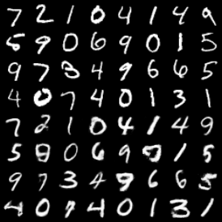
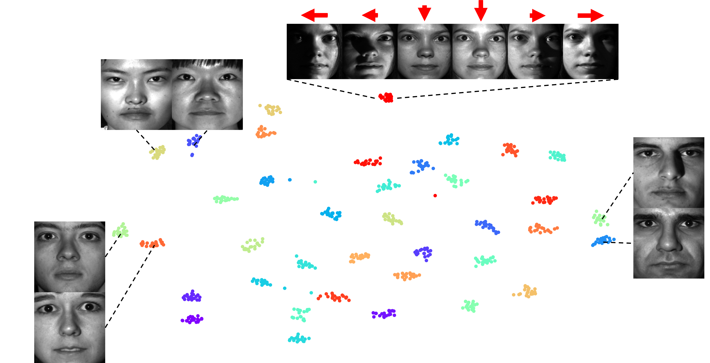

# Structured WAE (StrWAE)

This is the repository for the ["StrWAEs to Invariant Representations"](https://openreview.net/forum?id=kLZZWvqlEm&referrer=%5Bthe%20profile%20of%20Joong-Ho%20Won%5D(%2Fprofile%3Fid%3D~Joong-Ho_Won1)). We demonstrates
that Wasserstein autoencoders (WAEs) are highly flexible in embracing structural constraints such as conditional independence in order to capture invariance of latent variables to nuisance information. In particular, given a conditional independence structure of the generative model (decoder), corresponding encoder structure and penalties are derived from the functional constraints that define the WAE. These structural uses of WAEs, termed StrWAEs (“stairways”), open up a principled way of penalizing autoencoders to impose structural constraints. Utilizing these advantages, we present a handful of results on semi-supervised classification, conditional generation, and invariant representation tasks.

# Installation

You can install the necessary dependencies if you are using anaconda.
```
$ conda env create --name wae --file environment.yaml
$ conda activate wae
```

<!-- The following packages are required.

- python >= 3.8
- torch >= 2.0.1
- torchvision >= 0.15.2
- torchmetrics >= 1.2.0 (torchmetrics[image])
- tqdm
- matplotlib
- pandas
- sklearn
- scipy
- h5py
- wandb -->

# Contents

Various examples of StrWAEs have been implemented in this repository. When the code is executed, the training results are displayed in a W&B dashboard.

## Semi-supervised Classification

Semi-supervised classification with partially observed labels. Learned latent representations are independent to digit class.

- Dataset: MNIST with 100 labels, SVHN with 1000 labels (extra dataset is used for training)
- End-to-end training
- How to run:
    1. Pretrain a digit-classifier for each dataset first to evaluate the quality of conditional generation.
        ```
        $ python train_classifier.py --dataset mnist
        $ python train_classifier.py --dataset svhn
        ```
    2. Run the training script.
        ```
        $ bash scripts/strwae_mnist.sh
        $ bash scripts/strwae_svhn.sh
        ```
- Class-preserving generation result:

    First 4 rows: real images / Last 4 rows: generated images

    

## Conditional Generation Using Embedded Variables

Learning latent representations that are invariant to both identities and binary facial attributes. However, binary facial attributes are only available for 30,000 images. Moreover, we assume that the number of identities may not be known a priori, which means the test data may contain portraits of new individuals that were not in the training data. So we employed the entity embedding networks in order to embed the identities and attributes.

- Dataset: VGGFace2 dataset (label = identity, attribute = binary facial attributes); preprocessed to the HDF5 format.
- How to run:
    1. Pretrain (attribute, identity)-embedders.
        ```
        $ python pretrain_vgg.py
        ```
    2. Run the training script.
        ```
        $ bash scripts/strwae_embedder.sh
        ```
    3. Perform conditional generation tasks (class-preserving generation, style transfer, attribute manipulation).
        ```
        $ python vgg_cond_gen.py --data-dir=YOUR_DATA_PATH --checkpoint-path=YOUR_CHECKPOINT_PATH
        ```
- Class-preserving generation result:

    

## Invariant Representations

Learning invariant representations of controlled photographs, where the control variable is the light direction. The latent representations are invariant to the light direction while retaining the identity information.

- Dataset: Extended YaleB dataset (label = identity, attribute = light condition)
- How to run:
    1. Pretrain a identity embedder.
        ```
        $ python pretrain_eyaleb.py
        ```
    2. Run the training script.
        ```
        $ bash scripts/strwae_invariant.sh
        ```
    3. Evaluate the metrics; prediction accuracies from latent representations to identity information(↑) and light direction(↓).
        ```
        $ bash eyaleb_metric.py --data-dir=YOUR_DATA_PATH --checkpoint-path=YOUR_CHECKPOINT_PATH
        ```
- t-SNE of learned representations:

    


## Fair Representations

Learning fair representations, which encompass information of the label while excluding information related to the attribute. Since the label and attribute are correlated, the conditional modeling (given attribute) is required.

- Dataset: Adult Income dataset (label = an indicator of high income, attribute = gender); All features were binarized and preprocessed in pickle format.
- How to run:
    1. Preprocess the data.
        ```
        $ python utils/adult_preprocess.py --data-dir=YOUR_DATA_PATH
        ```
    2. Run the training script.
        ```
        $ bash scripts/strwae_fair.sh
        ```
    3. Evaluate the fairness metrics; $\Delta_{DP}$, the demographic parity.
        ```
        $ python adult_metric.py --data-dir=YOUR_DATA_PATH --checkpoint-path=YOUR_CHECKPOINT_PATH
        ```

# Citation

```
@inproceedings{
  lee2024strwaes,
  title={Str{WAE}s to Invariant Representations},
  author={Hyunjong Lee and Yedarm Seong and Sungdong Lee and Joong-Ho Won},
  booktitle={Forty-first International Conference on Machine Learning},
  year={2024},
}
```
